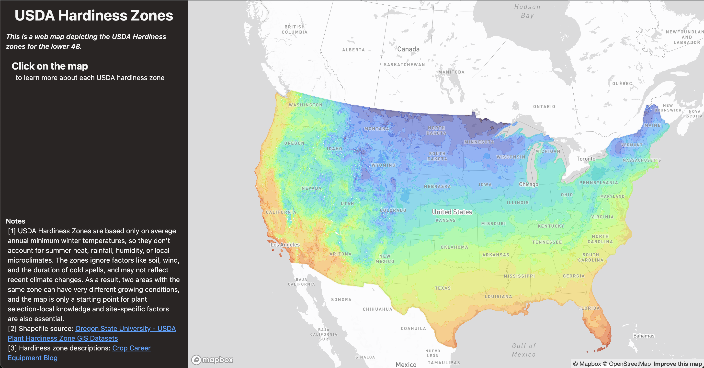

# HARDY CROPS -- PROJECT OVERVIEW

This project is live at: [https://hardy-crops-01.vercel.app/](https://hardy-crops-01.vercel.app/)

### The goals of this project are to:
1. illustrate the viability of common garden crops for each of the USDA Plant Hardiness Zones
2. demonstrate the integration of spatial data as a custom layer in a Mapbox instance
3. demonstrate use of map geometries as programmable, interactive features of a user interface

### Built with:
- React-TS
- Vite
- MapboxGl
- TailwindCSS

### Sources:
USDA Hardiness Zones Shapefile - [OregonState](https://prism.oregonstate.edu/projects/plant_hardiness_zones.php)
Hardiness Zone information - [Crop Career Equipment Blog](https://cropcareequipment.com/blog/best-crops-for-hardiness-zones/)

### Further reading
I talk through the process of building this and other projects in my blog. Read more of my thoughts on developing this project in this post -- [Hardy Crops, an Interactive Map of Crop Viability](https://simonconrad.com/home/hardy-crops-an-interactive-map-of-crop-viability)
